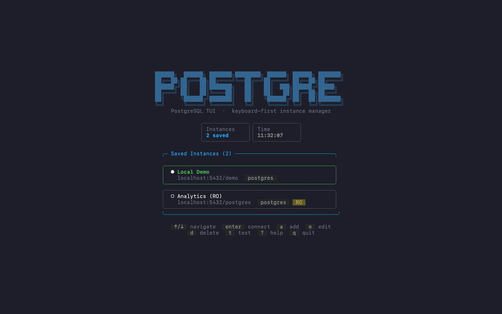
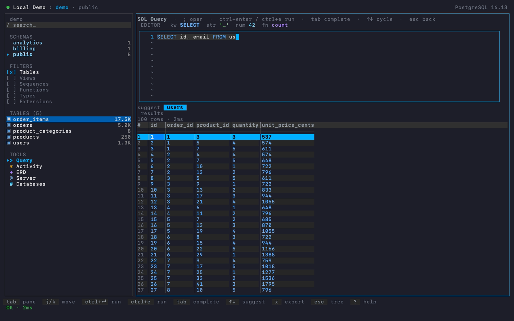
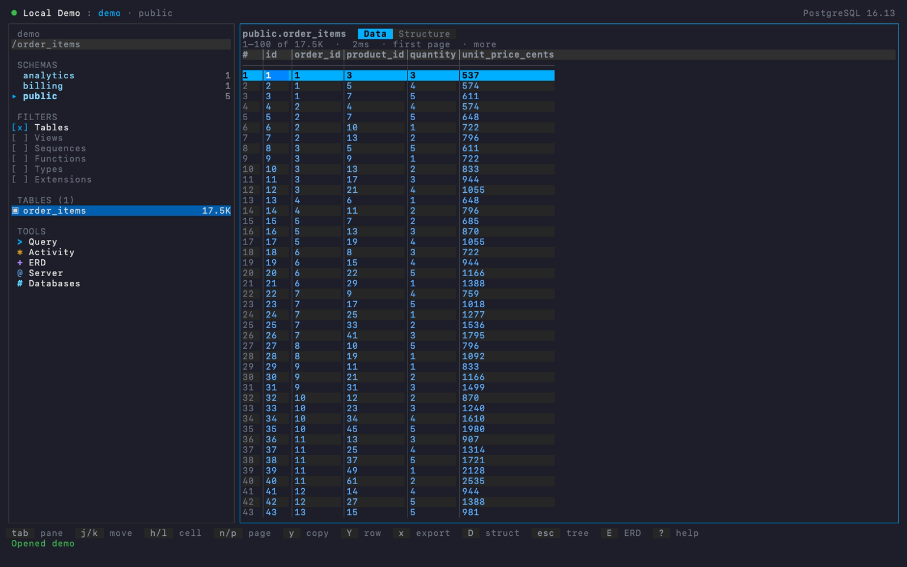
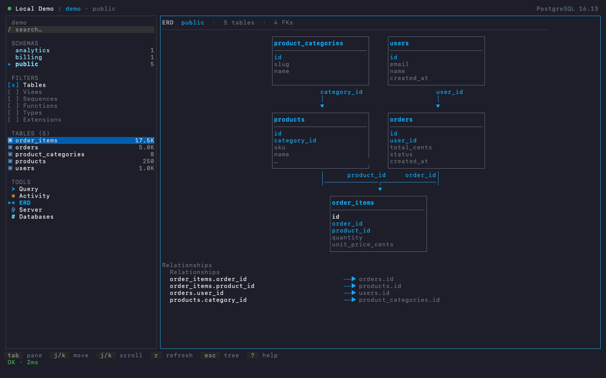

# PostgreSQL TUI Manager

[](https://github.com/davidbudnick/postgres-tui/actions/workflows/ci.yml)
[](https://github.com/davidbudnick/postgres-tui/actions/workflows/release.yml)
[](https://github.com/davidbudnick/postgres-tui/actions/workflows/ci.yml)
[](https://opensource.org/licenses/MIT)

A fast, keyboard-first terminal UI for PostgreSQL — built with Go and [Bubble Tea](https://github.com/charmbracelet/bubbletea). Sibling to [redis-tui](https://github.com/davidbudnick/redis-tui) and [es-tui](https://github.com/davidbudnick/es-tui).



## Features

- **Instance manager** — save and switch between multiple PostgreSQL servers
- **Database picker** — choose a database after connecting
- **Sidebar navigation** — schemas, tables, views, sequences, functions, types, extensions
- **Table browser** — paginated rows, describe (columns / indexes / constraints)
- **SQL query editor** — run queries, view results, export CSV
- **Activity** — `pg_stat_activity` style live backends
- **Server info** — version, encoding, connections, uptime
- **Read-only mode** — block mutating statements
- **SSL modes** — disable through verify-full
- **Fully keyboard-driven** — vim-style navigation, command palette

## Screenshots

SQL editor — syntax colors, smart complete, live results:



Table data grid (blue selection + typed cells):



ER diagram for the current schema:



## Quick Install

```bash
# Native install — recommended (macOS and Linux)
curl -fsSL https://raw.githubusercontent.com/davidbudnick/postgres-tui/main/install.sh | bash

# Homebrew (macOS and Linux)
brew tap davidbudnick/homebrew-tap
brew install --cask postgres-tui

# Go (requires Go 1.26+)
go install github.com/davidbudnick/postgres-tui@latest
```

> **Pre-built binaries** — [Download from GitHub Releases](https://github.com/davidbudnick/postgres-tui/releases)

## Terminal font

**No special font package required.** TOOLS tags and chrome use plain ASCII (`> * + @ #`, etc.), so the default monospace font in iTerm2, Terminal.app, Kitty, WezTerm, Ghostty, or Alacritty is fine. A Nerd Font is optional eye candy only—not a dependency.

## Installation

### Native Install (Recommended)

The install script auto-detects your OS and architecture, downloads the latest release, verifies the checksum, and installs the binary to `~/.local/bin` (override with `INSTALL_DIR`):

```bash
curl -fsSL https://raw.githubusercontent.com/davidbudnick/postgres-tui/main/install.sh | bash

# Custom install directory
INSTALL_DIR=/usr/local/bin curl -fsSL https://raw.githubusercontent.com/davidbudnick/postgres-tui/main/install.sh | bash
```

### Homebrew

See [Quick Install](#quick-install) above.

### From Source

```bash
# Clone the repository
git clone https://github.com/davidbudnick/postgres-tui.git
cd postgres-tui

# Build
make build

# Install to GOPATH/bin
make install
```

### Pre-built Binaries

Download the latest release from the [Releases](https://github.com/davidbudnick/postgres-tui/releases) page. Pre-built binaries are available for macOS, Linux, and Windows with no Go installation required.

### Using Go Install

> **Note:** Requires Go 1.26 or later.

```bash
go install github.com/davidbudnick/postgres-tui@latest
```

## Usage

```bash
# Interactive instance manager
postgres-tui

# Quick connect
postgres-tui --host localhost --user postgres --password secret --database mydb

# Read-only
postgres-tui --host db.example.com --read-only --sslmode require

# Update to the latest version
postgres-tui --update
```

### Uninstall

```bash
# Native install
rm -f ~/.local/bin/postgres-tui

# Homebrew
brew uninstall --cask postgres-tui

# Go
rm -f $(go env GOPATH)/bin/postgres-tui
```

### Keybindings

| Key | Action |
|-----|--------|
| `a` | Add instance |
| `enter` | Connect / open |
| `tab` | Toggle sidebar / main |
| `j` / `k` | Navigate |
| `D` | Describe object |
| `;` | Open SQL query editor (primary) |
| `:` | Open SQL query editor (alias) |
| `ctrl+enter` / `ctrl+e` | Run SQL in the editor |
| `A` | Activity |
| `i` | Server info |
| `b` | Switch database (filterable popup) |
| `/` | Filter objects |
| `ctrl+p` | Command palette |
| `?` | Help |
| `esc` | Back |
| `q` | Quit |

### SQL queries

1. Connect and open a database (sidebar tree loads).
2. **Open the editor** with **`;`** (or `:` / TOOLS → Query / palette).
3. Type SQL — keywords, strings, numbers, and functions are **syntax-colored as you type**; autocomplete suggests tables, columns, and keywords (`tab` to accept, `↑`/`↓` to cycle).
4. **Run** with **`ctrl+enter`** or **`ctrl+e`** (also `f5` / `ctrl+r` in many terminals).
5. Results appear below; `tab` moves focus editor ↔ results when no suggestion is open.
6. `x` exports the result grid as CSV; `esc` returns to the tree.

Prefill: with a table/view selected, `;` inserts `SELECT * FROM schema.table LIMIT 100;` and runs it once.

## Local Demo

```bash
make demo-run
```

That starts Postgres, seeds sample data, and launches the TUI with an **isolated** config copied from `docs/demo-config.json` (your real `~/.config/postgres-tui` is never modified). Instances come only from config — nothing is hardcoded or auto-seeded.

| Name | Database | Notes |
|------|----------|--------|
| **Local Demo** | `demo` | Full seed data (tables, orders, analytics) |
| **Analytics (RO)** | `postgres` | Read-only browse |

Then: select **Local Demo** → `e` edit → set password `postgres` → save → `enter` to connect → browse tables → `enter` for data / `D` structure / `;` query (`ctrl+enter` to run).

```bash
# Or step by step (uses your normal config — empty until you add instances):
make docker-up && make docker-seed && make run

# Or CLI quick-connect (skips the instance list):
./bin/postgres-tui --host localhost --user postgres --password postgres --database demo --sslmode disable

# Or point at the demo config without polluting HOME:
mkdir -p /tmp/pg-tui-demo/.config/postgres-tui
cp docs/demo-config.json /tmp/pg-tui-demo/.config/postgres-tui/config.json
HOME=/tmp/pg-tui-demo ./bin/postgres-tui
```

## Recording demos

The hero GIF (`docs/main.gif`) and screenshot PNGs under `docs/` are produced with [VHS](https://github.com/charmbracelet/vhs):

```bash
# Full animated README GIF (Docker Postgres + vhs)
make demo

# Refresh static PNGs used in the gallery above
make demo-ui
```

`docs/demo.tape` drives the hero GIF; `make demo-ui` refreshes the stills above.

## License

MIT
